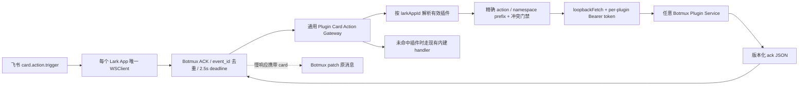

# 背景与实现上下文

## 路径约定

- plan_root: `.plan/card-action-plugin-gateway`
- unit_tests: `test/**/*.test.ts`
- e2e_tests: `test/**/*.e2e.ts`（本功能不依赖真实飞书；主流端到端链路放在 `test/plugin-card-action-gateway.integration.test.ts`，仍由 Vitest `unit` project 执行）
- test_helpers: `test/helpers/ts-runner.ts`
- docs: `docs/design`
- tsconfig: `tsconfig.json`

`plan.md` 的 `files_to_touch` 和 `test_files` 均按上述现有布局确定。凡需 spawn 可执行 mock 插件服务的测试，必须使用 `spawnTsScript`/`spawnTsEvalWithRepoImports`，不能直接拼 Node-only 的 `process.execPath --import tsx`。

## 已核对的现状

- `.codegraph/` 不存在，因此按仓库约定直接读取源码。
- 当前工作树已经存在未提交的进程内 `CardActionHandlerRegistry`、daemon fallback 接线、`action.name` 去重补充、测试和带 Happy Cloud 特例的 helper/设计文档。它们是本 Sprint 的输入，不是可回滚的噪声。
- `src/core/plugins/convention-scanner.ts` 从插件 `dist/` 的固定目录扫描 contribution；`src/core/plugins/install.ts` 在替换 runtime 和写 registry 前完成扫描，新增非私密 contribution 无需另造安装通道。
- `src/core/plugins/types.ts` 的 `InstalledPluginRecord.contributions` 是公开 registry 索引；私密数据不能进入 `plugins-registry.json` 或 `materialized.json`。
- `src/core/plugins/materializer.ts` 在插件启用时写 capability marker；全局与单 Bot 绑定由 `resolveEffectivePluginIds` 合并。
- `src/core/plugins/service-manager.ts` 管理机器级插件服务，已有稳定 `service.json`（含 status/port）、受控 PM2 env、更新/卸载运行态门禁和 start/stop/restart 语义。`plugin disable` 只停止能力路由，不自动停止 service；该既有语义保持不变。
- `src/im/lark/event-dispatcher.ts` 为每个非 `apiOnly` Lark App 维护一个 `WSClient`，已有 2.5 秒 ACK 竞速、稳定 `event_id` 去重、in-flight 去重、异常隔离和超时后消息卡片 patch。插件不得建立第二条 Lark WebSocket。
- `src/daemon.ts` 为每个 Bot 构造 `EventHandlers`；这里可按 `larkAppId` 计算有效插件集合并保留 `handleCardAction` 作为内建卡片兼容处理器。
- 本机 HTTP 必须使用 `src/core/loopback-fetch.ts`，不能退回全局 `fetch`；Bun 会在常见企业代理环境下把 `127.0.0.1` 请求和 Bearer token 送向代理。

## 目标架构



## 插件静态声明约定

固定扫描文件：`dist/card-actions/index.json`。

```json
{
  "schemaVersion": 1,
  "actions": ["example.review.submit"],
  "actionPrefixes": ["example.review."],
  "endpoint": "/botmux/card-actions/v1"
}
```

- `actions` 与 `actionPrefixes` 均为可选数组，但至少一个必须非空；两者只接受非空、去重后的静态字符串，不支持运行时模块名、远程 URL 或动态注册。
- 精确 action 优先于所有 prefix；没有精确命中时按最长 prefix 匹配，因此窄 namespace 可确定性覆盖宽 namespace。
- `endpoint` 必须是无 scheme/host/query/hash、无 `..`、以 `/` 开头的相对 HTTP path。
- `cardActions` 必须与 `service/index.js` 和 manifest `botmux.service` 同时存在；服务定义必须提供 1–65535 的固定 port。
- 不要求 action 绑定某个业务命名规则；同一 Bot 的有效插件集合内，相同精确 action 或相同 prefix 的重复声明 fail closed，不能按安装顺序抢占；不同长度的重叠 prefix 按最长匹配，不视为冲突。
- 公开 registry/materialized marker 只保存 exact/prefix allowlist 和 endpoint，不保存 token、完整回调或服务私密信息。

## 版本化 HTTP 协议

Botmux 构造 `http://127.0.0.1:<service-state.port><endpoint>`，使用 `loopbackFetch`：

```http
POST /botmux/card-actions/v1
Authorization: Bearer <per-plugin-token>
Content-Type: application/json
```

```json
{
  "schemaVersion": 1,
  "eventId": "evt_xxx",
  "larkAppId": "cli_xxx",
  "operator": { "open_id": "ou_xxx", "union_id": "on_xxx" },
  "context": { "open_message_id": "om_xxx" },
  "actionName": "example.review.submit",
  "action": {
    "name": "submit",
    "value": { "action": "example.review.submit" },
    "option": null,
    "formValue": {}
  }
}
```

- `actionName` 是路由使用的规范化 selector：优先 `action.value.action`，否则取 `action.name`；`action.name` 字段仍保留平台原值。
- 身份只来自 Lark SDK 验证后的 envelope `operator`；绝不从 `action.value` 补 owner/user。`open_id` 是 app-scoped，插件必须连同 `larkAppId` 使用。
- 不透传整个未知 envelope；仅传需求明确的 `eventId/operator/context/value/name/option/formValue`，日志不记录表单、operator、token 或响应正文。
- 请求 JSON 上限 256 KiB；插件响应上限 1 MiB；网关内部请求上限 30 秒。外层 2.5 秒 Lark ACK 仍优先，网关超时只负责最终释放 in-flight 工作。

插件响应：

```json
{
  "schemaVersion": 1,
  "ack": {
    "toast": { "type": "success", "content": "已接收" },
    "card": { "schema": "2.0", "body": {} }
  }
}
```

- `ack` 可为空，或包含合法 `toast`、`card`；非法 JSON、非法 schema、非 2xx、重定向、超限响应统一隔离成合法空 ACK。
- 2.5 秒内返回时直接交给现有 ACK shaping；超过 2.5 秒时 Botmux 先返回“后台处理中”，稍后仅当结果含 card 时 patch 原消息。
- Botmux 的 transport 去重不能替代插件业务幂等；插件仍须用 `eventId` 保护持久化和外部副作用。

## 私有 token 生命周期

- token 位于 `~/.botmux/plugins/<pluginId>/private/card-actions.token`，目录 `0700`、文件 `0600`，读取拒绝 symlink/非普通文件。
- 首次启动声明 `cardActions` 的插件服务时生成 32-byte 随机 token；更新与普通 restart 保持不变，卸载时随插件 home 删除。
- `service-manager` 在插件自定义 env 合并后冻结注入 `BOTMUX_PLUGIN_CARD_ACTION_TOKEN` 与 `BOTMUX_PLUGIN_CARD_ACTION_ENDPOINT`，插件配置不得覆盖。
- 每个插件 token 独立，不进入公开 registry、materialized 文件、状态报告或日志；网关与对应服务只读取同一份私有 capability。

## 影响范围

| 维度 | 影响与门禁 |
|---|---|
| 跨平台 | Node/Bun 均走 `loopbackFetch`；路径用 `node:path`；token 文件权限与 NOFOLLOW 在 macOS/Linux 验证。Windows 不承诺 POSIX mode，但必须保持路径安全和 loopback-only。 |
| 多 Bot | 每次回调按 `larkAppId` 解析 global + bot plugin binding；Bot A 启用不能让 Bot B 路由；同一服务可接收多个 App，但 payload 明示 App。 |
| 插件启停 | disable 立即停止该作用域路由但不停止 service；service stopped/offline 快速空 ACK；restart 保留 token 并无需 daemon restart 恢复路由。 |
| 插件安装/更新 | 扫描阶段拒绝非法 contribution；运行中 service 的更新/卸载继续沿用既有门禁；新 registry 记录在下一次回调读取，不注册进程内业务函数。 |
| 旧卡片 | 未命中有效插件 action 时仍调用现有 `handleCardAction`；其权限、会话和 UI 行为不改。 |
| Lark 重连 | contribution 来自持久化 registry/绑定，不依赖运行时 register；同一 dispatcher 重连后仍可路由且不会重复注册。 |
| 安全 | 安装插件仍是“受信本机代码”边界；外部 payload 只能选择静态 allowlist，不能选择 URL/模块；loopback 不是身份，必须叠加 per-plugin token。 |

## 明确不做

- 不在 Botmux `src/**`、测试或设计文档中保留 Happy Cloud action、finding、fix/ignore/defer、MR 等专用常量或业务判断。
- 不为任何接入方实现表单 schema、落盘、业务幂等或后续任务。
- 不新增插件到飞书的 WebSocket，也不开放远程 HTTP endpoint。
- 不改变插件 service 的机器级生命周期或 `plugin disable` 不停 service 的既有语义。
- 不要求真实飞书或线上接入方验收；用本机可执行 mock plugin service 完成主流链路。

## 风险与实现提示

- `serviceUrls()` 会把 loopback 展示 URL 改写成 Dashboard external host，网关不得使用 `openUrl`；只取校验后的 state port 并自行拼字面量 `127.0.0.1`。
- 网关必须按“精确 action 优先、prefix 最长匹配”选择接入方；同一 Bot 有两个有效插件声明相同 exact 或相同 prefix 时 fail closed。日志只含 app/plugin/action/status/duration 等安全元数据。
- 插件响应读取必须限长，不能先无界 `.text()`；Abort 后也必须释放连接和 in-flight claim。
- 当前进程内 Registry 和 Happy Cloud helper/doc/test 要重构或删除，不能在它们之上继续叠业务特例。
- `src/core/plugins/install.ts` 已核对：公开 scanner 结果会通过 `makeRecord` 自动进入原子安装事务，本 Sprint 预计无需修改该文件；若实现中发现必须改，先回写本 context 的原因与影响。

## 修订记录

- 2026-09-02：根据用户确认，从“进程内 Happy Cloud handler”修订为通用 Plugin Service + loopback HTTP + per-plugin token；单 Sprint 落地。
- 2026-09-02：补齐原需求 R2 的 namespace 注册能力；静态 contribution 支持可选 `actionPrefixes`，精确命中优先、prefix 最长匹配、同类重复声明按 Bot 作用域 fail closed。
