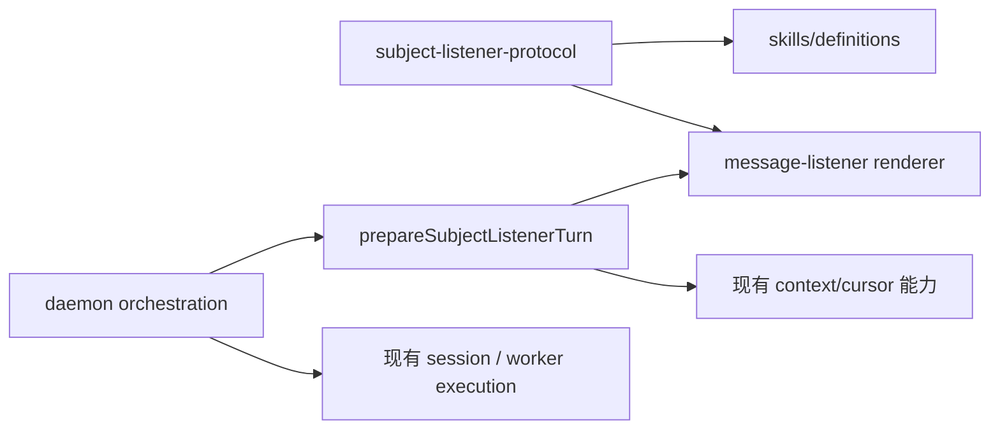

# Sprint 003：拆分 Subject 可信协议与 turn 准备边界

## 迭代目标（Goal）

把 Subject 的“规则”和“收集飞书现场”拆成稳定、可单测的主体层边界，同时继续复用现有 CLI、session、worker 和 Lark 执行链。重构后未 @ 的 Subject 消息获得的 prompt、发送者、群资料、历史快照和候选游标与当前行为一致；明确 @、legacy listener 与终态提交语义不变。

## 路径与变更清单

- `plan_root`: `.plan/subject-listener`
- `files_to_touch`:
  - `src/services/subject-listener-protocol.ts`（新增）
  - `src/services/subject-listener-turn.ts`（新增）
  - `src/services/message-listener.ts`
  - `src/skills/definitions.ts`
  - `src/daemon.ts`
- `test_files`（由 evaluator 新增或补充，generator 不写测试）:
  - `test/subject-listener-turn.test.ts`（新增）
  - `test/message-listener.test.ts`
  - `test/subject-listener-runtime.e2e.ts`
- `verification_only`（不要求修改）:
  - `test/subject-listener-context.test.ts`
  - `test/subject-listener-runtime.test.ts`
  - `test/event-dispatcher.test.ts`
- `tsconfig`: `tsconfig.json`、`tsconfig.scripts.json`

## 目标依赖方向



## 实现方案

### 1. 固定可信协议所有权

- 在 `src/services/subject-listener-protocol.ts` 中导出当前 `BOTMUX_SUBJECT_PROTOCOL`；协议正文保持逐字等价，不新增产品规则。
- `src/skills/definitions.ts` 改为从协议模块组装内置 `botmux-subject` Skill。
- `src/services/message-listener.ts` 改为从协议模块渲染 Subject 首轮，不再导入 `skills/definitions.ts`。
- 协议模块不得依赖 Skill catalog、daemon、Lark client、session 或 worker，避免形成新的循环依赖。

### 2. 提取 Subject turn 准备边界

- 新增 `src/services/subject-listener-turn.ts`，导出：
  - `prepareSubjectListenerTurn(input, dependencies)`；
  - `PreparedSubjectListenerTurn`，至少包含 `prompt`、`chatContext`、`resolvedSender`、`candidateCursor`；
  - 与上述函数直接相关的最小 input/dependencies 类型。
- input 只携带当前入站事件已经确认的事实：Bot/Lark app、群、群类型、消息 id、原始 trigger message、Subject match、原始 sender id/type 与 dataDir。
- 准备函数集中完成：
  1. 校验这是 group + `behavior=subject`，match trigger 与当前 event message id 一致且 createTime 为整数串；
  2. 通过注入依赖解析当前发送者，并只在 match 未提供 senderName 时用解析结果补齐渲染输入；不得把 CLI session transcript 当上下文；
  3. 通过注入依赖读取群资料与 Bot+群持久化游标；
  4. 复用 `loadSubjectListenerContext`，按当前 fallback/trigger 规则读取截止触发消息的飞书快照；
  5. 复用 `renderMessageListenerPrompt` 生成 prompt，并返回快照的 candidate cursor。
- 网络与持久化最小依赖为现有 sender resolver、chat context getter、cursor reader、Lark message scanner；不要创建新的 client/store/runtime 类。
- 准备函数不得推进游标、创建 session、启动 worker、写 admission 或 settle completion。

### 3. 收薄 daemon 编排

- `src/daemon.ts` 保留事件/卡片解析和 Subject completion gate 检查；在 session 创建前调用 `prepareSubjectListenerTurn(...)`。
- daemon 用返回值替代现有内联的 sender/chat/cursor/snapshot/prompt 组装，并继续把 `chatContext`、`resolvedSender`、`candidateCursor` 写入原有 session/turn 注册位置。
- 删除 daemon 对 `loadSubjectListenerContext`、`readSubjectListenerCursor` 的直接依赖；dispatcher、worker-pool 和 core types 不改职责、不新增并行执行链。

### 4. 回归与影响面

- 平台：本 sprint 只重排 Lark Subject 的 TypeScript 依赖，不加入路径、shell 或平台分支，macOS/Linux 行为应一致；其它 IM 无新入口。
- CLI：首轮仍作为同一字符串进入既有 20+ CLI adapter，共享 CLI/runner contract 不修改。
- 后端与会话：Pty/Tmux/其它 backend、普通话题/群会话、adopt/restore、sandbox、v3 workflow 均沿用现有 session/worker；不新增第二 session/runtime。
- Listener：明确 @ 仍由 matcher 绕过 Subject；legacy prompt listener 不经过 turn preparer；Subject 的 FIFO、隐藏辅助 UI、终态和 cursor commit 仍由现有 dispatcher/worker 实现。

## 不做范围

- 不处理 R-1 的 session ownership 路由修复。
- 不处理 R-2 的游标错误分级与日志策略。
- 不处理 R-3 的 Subject policy 统一解析与 fail-closed。
- 不处理 R-5 的 Dashboard 截图、live daemon 切换或真实飞书验收。
- 不修改 `messageListeners` 公共配置、Subject 协议语义、游标格式或终态判据。

## 场景（BDD）

```gherkin
Feature: 拆分 Subject 可信协议与 turn 准备边界
  As a 在飞书群中监听现场的 Subject Bot
  I want 通过稳定主体层准备边界获得规则和飞书现场
  So that 我继续复用现有 CLI 执行能力，同时协议与运行时职责可以独立维护和验证

  Background:
    Given 某 Bot 已在目标飞书群启用 behavior=subject 的消息监听
    And 发送者解析、群资料、游标与飞书消息扫描由可控测试替身提供
    And 现有 CLI、session、dispatcher 与 worker 执行链保持不变

  Scenario: 未被 @ 的群消息携带完整飞书现场进入现有 CLI  @id=S-1
    Given 当前事件是与 Subject match 精确对应的未 @ 群消息且存在已提交游标
    When daemon 为该入站消息准备 Subject 首轮
    Then 交给现有 CLI 的 prompt 应包含解析后的群资料、触发发送者与游标之后的飞书历史
    And 返回的 candidate cursor 应等于当前精确 trigger

  Scenario: 内置 Subject Skill 与监听首轮使用同一份可信协议  @id=S-2
    Given 内置 botmux-subject Skill 与 Subject 消息渲染器均已加载
    When 系统分别生成 Skill 内容和 Subject 首轮 prompt
    Then 两者应包含同一份完整 BOTMUX_SUBJECT_PROTOCOL
    And 飞书群资料、发送者和历史只能位于不可信上下文包络中

  Scenario: 无效的 Subject trigger 在创建会话前被拒绝  @id=S-3
    Given Subject match 的消息 id、群类型或 createTime 与当前入站事件不一致
    When daemon 尝试准备该 Subject 首轮
    Then turn 准备应返回可诊断错误且不得生成 PreparedSubjectListenerTurn
    And 现有 session 与 worker 启动入口不应被调用
```

## Generator 交付约束

- 只修改 `files_to_touch`，不得新增通用 Subject framework 或改动 dispatcher/worker/core/config。
- 只搬移并封装现有行为；若发现必须改变 R-1、R-2、R-3 或 R-5 才能完成，停止并反馈，不得顺带修复。
- 仓库已有测试基建，generator 不写 `test_files`；测试由 evaluator 按 rubrics 后补。
- 不运行 `bun install`，不切换或重启 live daemon，不操作 git index/HEAD。

## 评分标准

见 [eval-rubrics.yaml](./eval-rubrics.yaml)。
