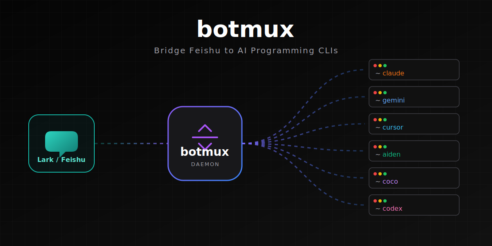
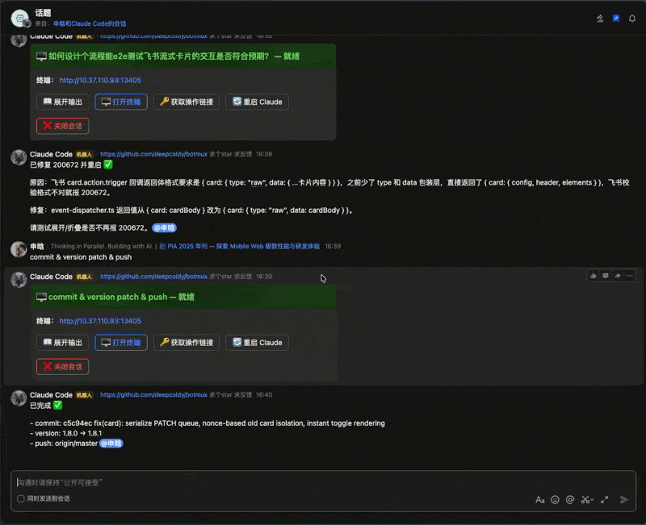
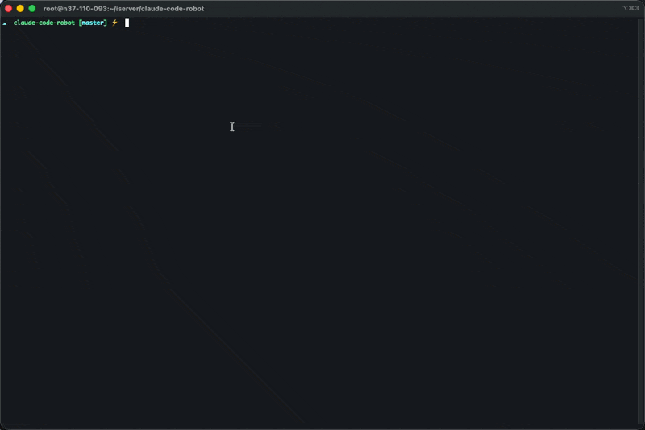
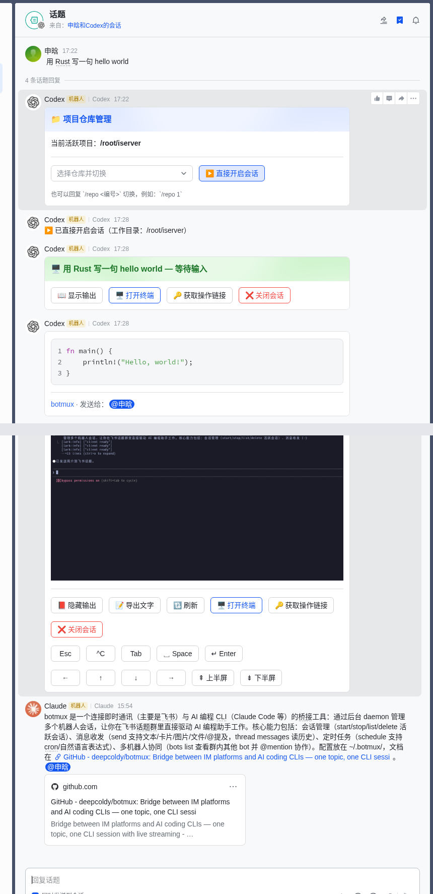
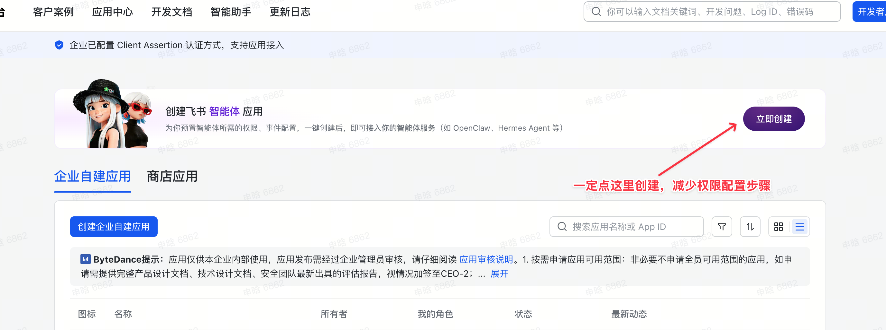
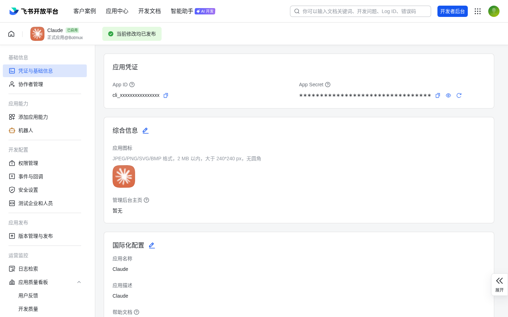
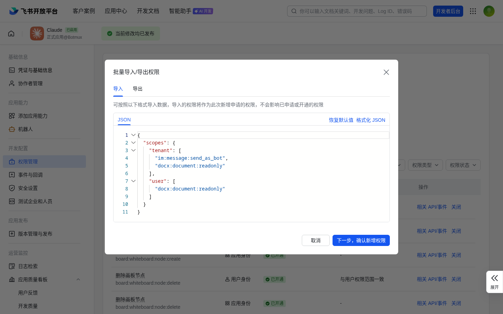
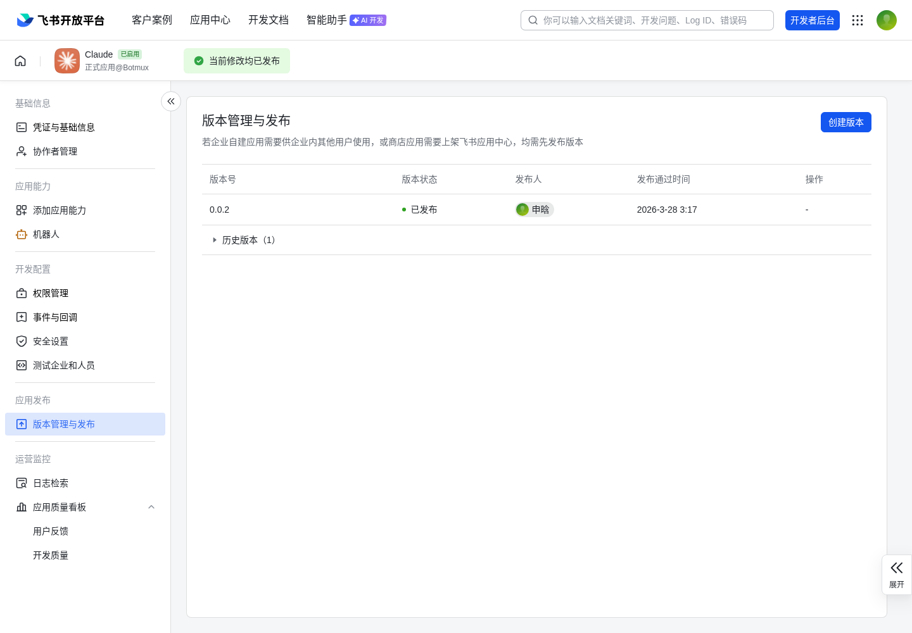
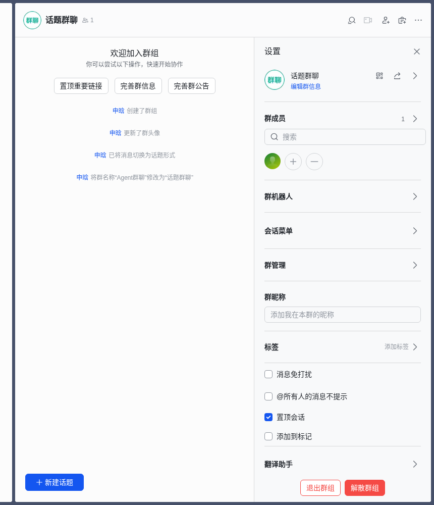

# botmux

<p align="center">
  
</p>

<p align="center">
  <a href="LICENSE"></a>
  = 20">
  <a href="https://www.npmjs.com/package/botmux"></a>
  <a href="https://github.com/deepcoldy/botmux"></a>
</p>

<p align="center">
  <a href="#design-philosophy">Design</a> &middot;
  <a href="#key-advantages">Advantages</a> &middot;
  <a href="#5-minute-setup">Quick Start</a> &middot;
  <a href="#usage">Usage</a> &middot;
  <a href="#configuration">Config</a>
</p>

[中文](README.md) | English

**Plug any AI coding CLI into Lark (Feishu) topic groups — one thread per session, streaming cards, web terminal, zero glue code.**

| Lark Streaming Cards | Web Terminal | tmux Session Management | Multi-Bot Collaboration |
|:-:|:-:|:-:|:-:|
|  |  |  |  |

<details>
<summary>Full demo video</summary>

[Demo Video](https://github.com/user-attachments/assets/3ba4c681-0a7e-4a03-89c8-b8d26b544a65)
</details>

---

## Why botmux?

### Design Philosophy

Core philosophy: **Bridge CLIs, don't rebuild them**. botmux doesn't reimplement Agent capabilities — it bridges existing AI coding CLIs (Claude Code, Codex, Gemini, OpenCode) directly. Memory, context management, tool use, permission systems — these capabilities are evolving rapidly within the CLIs themselves. botmux rides on top of that evolution rather than rebuilding in parallel. Every CLI upgrade benefits botmux automatically with zero adaptation.

### Key Advantages

Compared to OpenClaw-style approaches built on Agent SDKs:

| Feature | botmux | OpenClaw-style |
|---------|--------|---------------|
| Architecture | Bridges full CLI processes directly | Rebuilds on Agent SDK |
| CLI Capabilities | Full runtime (hooks, memory, plan mode, skills, `/` commands) | SDK API subset, missing features must be reimplemented |
| CLI Upgrades | Zero-adaptation automatic benefit | Must track SDK version changes |
| Memory / Context | Reuses CLI's built-in memory system, improves as the CLI evolves | Must build custom memory system, duplicating CLI-native capabilities |
| Multi-CLI Support | 4 CLIs, switch with one config (Claude Code / Codex / Gemini / OpenCode) | Tied to a single SDK, cannot switch CLIs |
| Web Terminal | Interactive full terminal, mobile shortcut toolbar, phone/desktop/Lark tri-screen sync | Usually web chat UI or read-only output |
| Multi-Bot Collaboration | Multiple bots in same group via @mention routing, isolated processes, different CLIs sparring | Usually single bot |
| Terminal Access | tmux attach directly into the CLI process, same as local dev experience | No direct terminal access |
| Installation | `npm install -g botmux`, 5-min Lark setup | Easy to install, but more configuration needed |

---

## Prerequisites

- **Node.js** >= 20
- **AI coding CLI** installed and authenticated (`claude`, `codex`, `gemini`, or `opencode` in PATH)
- **tmux** >= 3.x (optional — auto-enabled when installed for persistent CLI sessions)
- **CJK fonts** (only needed for screenshot rendering of Chinese text / emoji):
  - macOS: ships with PingFang / Hiragino, no action needed
  - Debian/Ubuntu: daemon will background-install `fonts-noto-cjk fonts-noto-color-emoji` on first boot if missing (requires passwordless sudo or running as root; restart the daemon after install)
  - Other Linux distros: install Noto CJK + Noto Color Emoji manually (package names vary)

## 5-Minute Setup

### Step 1: Create a Lark App

Go to the [Lark Open Platform](https://open.larkoffice.com/app) and click "Create Custom App".



### Step 2: Get Credentials

Open the app details page → "Credentials & Basic Info", and copy the **App ID** and **App Secret**.



### Step 3: Add Permissions

Go to "Permissions & Scopes" → "Batch Import/Export", and paste the following JSON to import all permissions at once:



<details>
<summary>Click to expand batch import JSON</summary>

```json
{
  "scopes": {
    "tenant": [
      "contact:user.base:readonly",
      "contact:user.id:readonly",
      "im:chat:read",
      "im:chat.members:bot_access",
      "im:chat.members:read",
      "im:message",
      "im:message:readonly",
      "im:message:send_as_bot",
      "im:message:update",
      "im:message.group_at_msg",
      "im:message.group_at_msg:readonly",
      "im:message.group_msg",
      "im:message.p2p_msg:readonly",
      "im:message.reactions:write_only",
      "im:resource"
    ]
  }
}
```
</details>

### Step 4: Install & Start botmux

```bash
# Install
npm install -g botmux

# Interactive setup — enter the App ID and App Secret from Step 2
botmux setup

# Start (must be running before configuring WebSocket subscription — Lark checks for an active connection)
botmux start
```

### Step 5: Configure Event Subscription

Back in the Lark Open Platform, go to "Events & Callbacks":

1. **Subscription mode**: Click the edit icon, select "Receive events via persistent connection" (WebSocket) — requires botmux to be running so Lark can detect the connection


2. **Add event**: Click "Add Event", search and add `im.message.receive_v1` (Receive messages v2.0)


3. **Enable callback**: Switch to the "Callback Configuration" tab, turn on "Card action callback" (`card.action.trigger`)

### Step 6: Publish the App

Go to "Version Management & Release", click "Create Version" and publish. Set availability to "Visible to me only" for automatic approval.



### Step 7: Create a Group and Start Chatting

1. Create a **topic-enabled group** in Lark
2. Go to Group Settings → Bots → Add the bot you just created
3. Send a message in the group — the bot responds automatically



### Step 8: Enable Boot-time Autostart (recommended)

Once the bot is sending and receiving messages cleanly, run:

```bash
botmux autostart enable
```

This registers the daemon with your user's init system (launchd on macOS, user systemd on Linux). **No sudo required.** After a reboot — or after logging back in — the daemon comes up on its own; you never need to remember `botmux start` again.

- The command only manages the "starts at boot" hook — it does **not** touch a running daemon.
- On a headless Linux box where you log out between sessions, also run `sudo loginctl enable-linger <your-user>` so user systemd survives logout. The command warns you if linger is off.
- To disable autostart: `botmux autostart disable` (also leaves the daemon alone). Check state: `botmux autostart status`.
- After switching nvm/fnm Node versions, re-run `botmux autostart enable` to refresh the embedded paths — `botmux start`/`restart` also detect path drift and refresh in place.

See [CLI Commands § Boot-time Autostart](#boot-time-autostart) below for the full reference.

---

## Features

### Streaming Cards

Each conversation turn gets a live-updating Feishu card that shows:

- Real-time terminal output rendered as Markdown, TUI chrome auto-filtered to show only actual work output
- Status indicator: Starting > Working > Idle
- Action buttons: Open Terminal, Get Write Link, Restart CLI, Close Session


### Web Terminal (Interactive)

Each session exposes a web terminal at `http://<WEB_EXTERNAL_HOST>:<port>`.

- **Read-only link** — shown on the streaming card in the group thread
- **Write-enabled link** — sent via DM on demand (click "Get Write Link" on the card)

On mobile/tablet, a floating shortcut toolbar provides Esc, Ctrl+C, Tab, arrow keys and other control keys missing from virtual keyboards — full CLI control from your phone.

### Multi-Bot Collaboration

Run multiple Lark bots on a single machine, each mapped to a different CLI. In the same group chat, messages are routed via @mention — each bot gets its own isolated CLI process. With a single bot in the group, it responds automatically without @.

### Tmux Persistence

When tmux is installed, botmux automatically uses it. CLI processes persist inside tmux sessions — all features work unchanged.

**Key benefit: daemon restarts don't interrupt the CLI.** During `botmux restart`, the worker process exits but the tmux session (and the CLI inside it) keeps running. The next incoming message triggers a re-attach — no `--resume` context reload needed.

```bash
# Recommended: interactive session picker — select and attach to tmux
npx botmux list

# Or manually attach (session name = bmx-<first 8 chars of session ID>)
tmux attach -t bmx-<first-8-chars-of-session-id>
# Ctrl+B, D to detach — CLI keeps running

# Force pure pty mode (disable tmux)
BACKEND_TYPE=pty botmux start
```

`botmux list` provides an interactive TUI showing all active sessions with ID, title, working directory, PID, uptime, and status. Use arrow keys to select and Enter to attach. Use `botmux list --plain` for plain-text table output suitable for scripting.

**Session naming:** `bmx-<first 8 chars of session UUID>`

**Lifecycle:**

| Event | tmux session | CLI process |
|-------|-------------|-------------|
| `botmux restart` | Survives | Survives (re-attaches on next message) |
| `/close` or close button | Destroyed | Terminated (SIGHUP) |
| CLI exits / crashes | Closes with it | Already exited (auto-restart creates new session) |

### Session Adopt

Seamlessly connect Botmux to CLI processes already running in tmux — monitor and interact from your phone via Lark.

```
/adopt              # Scan tmux, show selection card
/adopt 0:2.0        # Directly adopt a specific tmux pane
```

- **Shared mode** — After adopting, iTerm2 and Lark stay in sync: streaming card shows real-time terminal output, Lark chat input is forwarded directly to the terminal
- **One-click takeover** — Click the "Takeover" button on the streaming card to rebuild the session with `--resume` and convert to a standard Botmux session
- **Safe disconnect** — Click "Disconnect" to detach Botmux without affecting the original CLI

### Scheduled Tasks

Three schedule types (once / interval / cron) with Chinese/English natural
language, executed inside the original thread (no new topic per run).

**Two ways to create**:
- **Slash command** (quick): `/schedule 每日17:50 check AI news`
- **Conversation** (flexible): just tell the agent "add a reminder for every day at 9:00 to check deploys" — the `botmux-schedule` Skill fires automatically.

Supported formats: Chinese NL (`每日17:50` / `30分钟后` / `明天9:00`),
English duration (`30m`), interval (`every 2h`), cron (`0 9 * * *`),
ISO timestamp (`2026-05-01T10:00`).

### Lark integration (Skill + CLI)

When a CLI spawns inside a botmux session it automatically gets
`~/.botmux/bin` on PATH plus a set of ready-to-use Skills:

- `botmux send` — send a message to the current thread (text, images, files, @mention)
- `botmux thread messages` — fetch thread history
- `botmux bots list` — discover bots + their `open_id`s
- `botmux schedule` — manage scheduled tasks

These capabilities are wired via `--append-system-prompt` and Skill
descriptions, so the agent picks them up automatically. Compared to
Anthropic's official Telegram channel — which exposes each action as an
MCP tool — the Skill + CLI combo skips the MCP handshake on every CLI
launch, doesn't burn tool-list tokens, and works across every CLI that
can read a system prompt and shell out (Claude Code / Codex / Gemini /
OpenCode), with no MCP protocol support required.

---

## Usage

### Workflow

1. Send a message in your Lark topic group to create a new thread
2. The bot shows a repo selection card — pick a project or click "Start directly"
3. The CLI spawns in the selected directory
4. A live streaming card appears in the thread, showing real-time terminal output with markdown rendering
5. Each reply creates a new streaming card for that turn; previous cards freeze at their last state
6. Click "Get Write Link" on the card to receive a write-enabled terminal URL via DM
7. The CLI replies in the thread via the `botmux send` command (wired through the `botmux-send` Skill)

### Slash Commands

| Command | Description |
|---------|-------------|
| `/repo` | Show project selector card |
| `/repo <N>` | Switch to Nth project from last scan |
| `/skip` | Skip repo selection, start session directly |
| `/cd <path>` | Change working directory |
| `/status` | Show session info (uptime, terminal URL, etc.) |
| `/restart` | Restart CLI process |
| `/close` | Close session and terminate CLI |
| `/adopt` | Adopt a running CLI session (tmux) |
| `/schedule` | Manage scheduled tasks |
| `/help` | Show available commands |
| `/compact` `/model` `/clear` `/plugin` `/usage` | Forwarded verbatim to the underlying CLI (e.g. Claude Code's built-in slash commands) |

### Scheduled Task Management

**Recommended: talk to the agent**
Just say "add a reminder to summarize yesterday's PRs every morning at 9:00" — the `botmux-schedule` Skill handles it and confirms with you.

**Slash command (quick)**

```
# Chinese NL
/schedule 每日17:50 check AI news
/schedule 工作日每天9:00 run health check
/schedule 每周一10:00 generate weekly report

# One-shot
/schedule 30分钟后 verify deployment
/schedule 明天9:00 standup reminder

# English
/schedule every 2h probe services
/schedule 30m remind me to drink water

# Cron
/schedule 0 9 * * * good morning
```

Manage tasks:

```
/schedule list
/schedule remove <id>
/schedule enable <id>
/schedule disable <id>
/schedule run <id>
```

**Execution behavior**: the task fires inside the **original thread where it was created** — no new topic per run. Working directory is preserved. If the original session is still alive, the prompt is injected into it; otherwise a fresh worker spawns bound to the same thread root.

---

## Configuration

Configure bots via `~/.botmux/bots.json`. Run `botmux setup` to create it interactively, or edit manually.

```bash
# Interactive setup
botmux setup
```

**bots.json format:**

```json
[
  {
    "larkAppId": "cli_xxx_bot1",
    "larkAppSecret": "secret_1",
    "cliId": "claude-code",
    "workingDir": "~/projects",
    "allowedUsers": ["alice@company.com"]
  },
  {
    "larkAppId": "cli_xxx_bot2",
    "larkAppSecret": "secret_2",
    "cliId": "codex",
    "workingDir": "~/work"
  }
]
```

| Field | Required | Description |
|-------|----------|-------------|
| `larkAppId` | Yes | Lark app ID |
| `larkAppSecret` | Yes | Lark app secret |
| `cliId` | No | CLI adapter, defaults to `claude-code` (options: `aiden`, `coco`, `codex`, `gemini`, `opencode`) |
| `cliPathOverride` | No | CLI binary path override |
| `backendType` | No | Session backend: `pty` or `tmux` (auto-detected by default) |
| `workingDir` | No | Default working directory, supports comma-separated |
| `allowedUsers` | No | Allowed users (email prefixes or open_ids) |
| `projectScanDir` | No | Directory to scan for git repos |

**Config priority:** `BOTS_CONFIG` env var > `~/.botmux/bots.json`

### Environment Variables

| Variable | Default | Description |
|----------|---------|-------------|
| `BOTS_CONFIG` | _(unset)_ | Path to bots.json (overrides default location) |
| `WEB_HOST` | `0.0.0.0` | HTTP server bind address |
| `WEB_EXTERNAL_HOST` | _(auto-detect LAN IP)_ | External hostname/IP for terminal URLs |
| `SESSION_DATA_DIR` | `~/.botmux/data` | Where sessions and queues are stored |
| `DEBUG` | _(unset)_ | Set to `1` for debug logging |

### File Locations

| Path | Description |
|------|-------------|
| `~/.botmux/bots.json` | Bot configuration |
| `~/.botmux/data/` | Session data, message queues |
| `~/.botmux/logs/` | Daemon logs |

---

## CLI Commands

| Command | Description |
|---------|-------------|
| `botmux setup` | Interactive setup (first-time or add bots) |
| `botmux start` | Start daemon (PM2 managed) |
| `botmux stop` | Stop daemon |
| `botmux restart` | Restart daemon (auto-restores active sessions) |
| `botmux logs` | View daemon logs (`--lines N` for more) |
| `botmux status` | Show daemon status |
| `botmux upgrade` | Upgrade to latest version |
| `botmux list` | List all active sessions (alias: `ls`) |
| `botmux delete <id>` | Close a session by ID prefix (alias: `del`/`rm`) |
| `botmux delete all` | Close all active sessions |
| `botmux delete stopped` | Clean up zombie sessions with dead processes |
| `botmux autostart enable` | Register boot-time autostart (macOS launchd / Linux user systemd, no sudo) |
| `botmux autostart disable` | Unregister boot-time autostart |
| `botmux autostart status` | Show autostart status |

### Boot-time Autostart

`botmux autostart enable` registers the daemon with your user's init system so it comes back automatically after a reboot:

- **macOS**: writes `~/Library/LaunchAgents/com.botmux.daemon.plist` and loads it via `launchctl bootstrap`. **No sudo required.**
- **Linux**: writes `~/.config/systemd/user/botmux.service` and runs `systemctl --user enable --now`. **No sudo required.**
  - On servers / headless boxes the user systemd manager stops when you log out. To survive logouts and reboots, also run `sudo loginctl enable-linger <your-user>` — `autostart enable` warns when linger is off.
  - Containers / SSH-only sessions without a user DBus fall back to printing manual instructions.
- The `node` and `cli.js` paths baked into the unit come from `process.execPath` at install time. After switching nvm/fnm versions, run `botmux autostart enable` once to rewrite. `botmux start`/`restart` also detect path drift and refresh the unit in place — no manual step needed.
- `enable` / `disable` **only manage the autostart hook — they do not touch a running daemon**. To start the daemon right away run `botmux start`; to stop it run `botmux stop`. This avoids the "I just wanted to turn off autostart, why did my service also die" footgun.
- If you prefer letting systemd own the lifecycle (`systemctl --user start/stop botmux`), that works too — the unit declares `ExecStop=botmux stop` for a clean shutdown path.

### Agent-facing subcommands

Run from inside a botmux-spawned CLI session — session context is auto-detected via ancestor process markers:

| Subcommand | Description |
|------------|-------------|
| `botmux send [content]` | Send a message to the current thread (stdin / heredoc / `--content-file`; `--images` / `--files` / `--mention` flags) |
| `botmux bots list` | List bots in the current chat (includes `open_id` for `--mention`) |
| `botmux thread messages [--limit N]` | Fetch thread message history (JSON) |
| `botmux schedule add <schedule> <prompt>` | Create a scheduled task bound to the current thread |
| `botmux schedule list/remove/pause/resume/run` | Manage scheduled tasks |

These require the `~/.botmux/bin/botmux` wrapper, which the daemon writes at startup and prepends to the worker's `PATH` — always matches the running daemon's version (no `npm i -g` needed).

---

## Contributing

See [CONTRIBUTING.md](CONTRIBUTING.md).

## License

[MIT](LICENSE)
