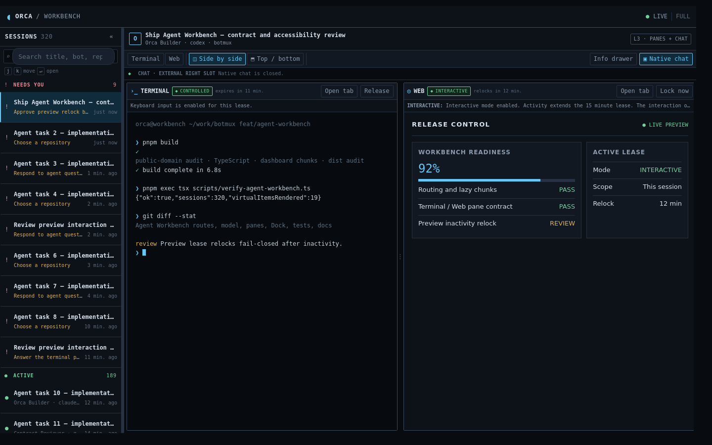
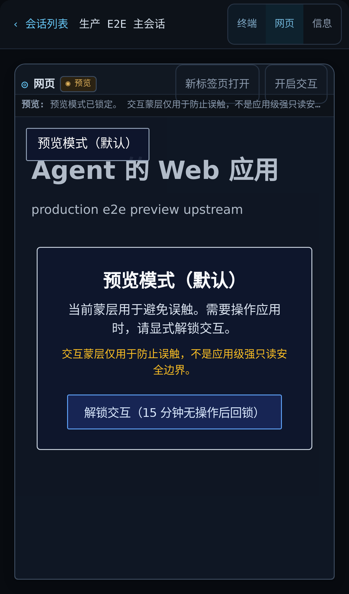
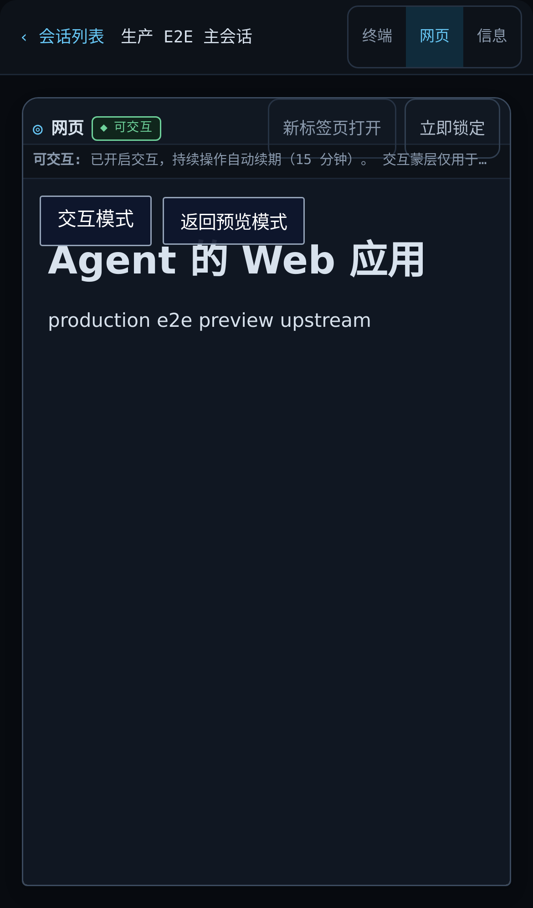
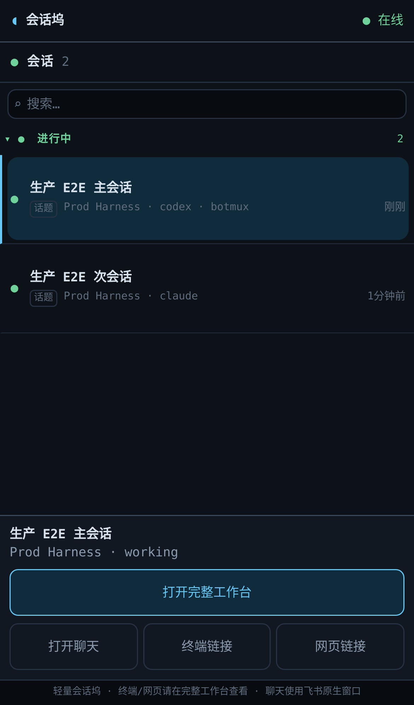
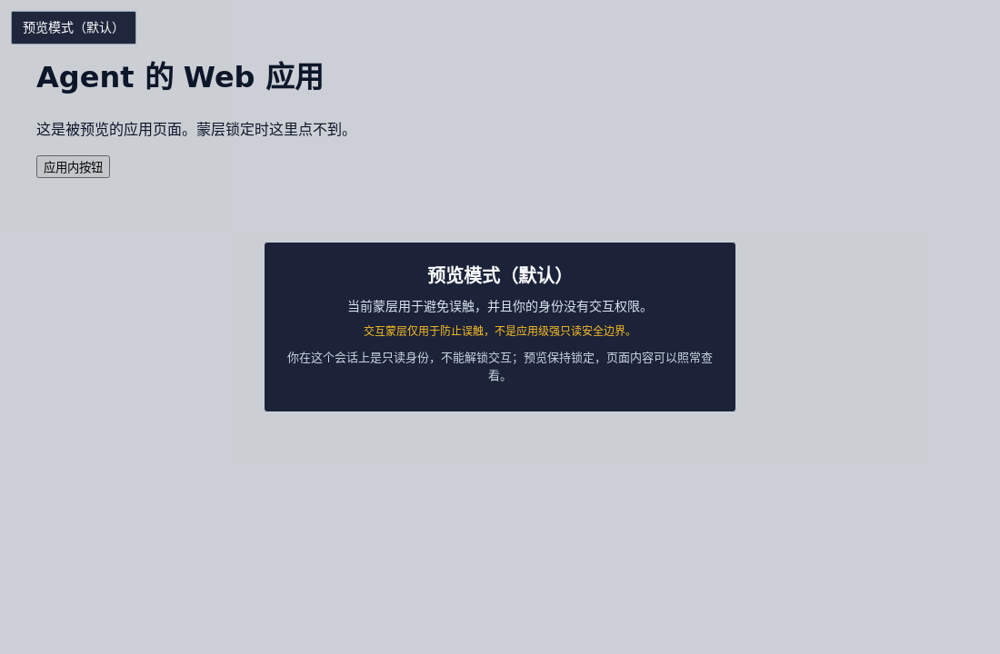

# Agent Workbench 使用指南

> 本文是面向 botmux 使用者的功能介绍与上手教程。实现细节与验收记录见 [agent-workbench-implementation.md](agent-workbench-implementation.md)，UI 契约速查见 [agent-workbench-ui.md](agent-workbench-ui.md)。

## 1. Workbench 是什么

Agent Workbench（工作台）是 botmux Dashboard 里新增的一个全屏页面：左边一条会话列表，把你名下所有 bot、所有群/话题里正在跑的 AI 会话收进一屏——谁在干活、谁干完了、谁卡住等你拍板，一眼看清；右边一个工作区，选中任何会话就能只读围观它的终端，需要时一键接管键盘直接输入。Agent 在会话里起了个网页服务（比如 dev server），跑一条 `botmux preview <端口>`，你就能在工作台里安全地预览它的页面。桌面浏览器、飞书侧边栏、手机上都能用。



一句话：以前你要在十几个飞书话题之间来回翻，现在打开工作台，所有会话尽收眼底，看终端、回消息、控输入、看网页，一个页面全搞定。

## 2. 功能亮点速览

### 会话列表：分组、搜索、未读，几百个会话不乱

会话可按六个维度分组（状态/机器人/会话位置/类型/CLI/活跃时间），组可折叠，支持搜索和键盘导航；列表做了虚拟滚动，300+ 会话照样流畅。不管选哪个维度，「待你处理」永远置顶红色高亮——bot 举手求助的、等你选仓库的、刚回完话你还没看的，全在最上面。效果见上方主图：左侧「待你处理 9」置顶，下面是「进行中 189」。

### 终端：默认只读围观，一键接管输入

点会话行的「终端」按钮，右侧就出现该会话的实时终端，默认只读、随便看不怕误碰。要打字时点「接管输入」，拿到一个短时独占租约（默认 5 分钟，倒计时可见），期间只有你能输入；点「释放输入」、租约到期或断线都会自动回到只读。主图右侧终端标题栏的「◆可输入 · 11 分钟后到期」就是接管中的状态。

### 网页预览：Agent 起的服务，安全地看、放心地点

Agent 在会话里执行 `botmux preview 5173` 之类的命令注册预览后，工作台就多出「网页」入口。页面默认罩着一层防误触蒙层，想操作就点「开启交互」，15 分钟没动静自动锁回去。被预览的应用被关在独立沙箱里，碰不到 Dashboard 的登录态和管理接口。

| 锁定（默认） | 解锁后 |
|---|---|
|  |  |

### 会话坞：飞书侧边栏里的轻量形态

不想开完整页面时，还有一个专为飞书侧边栏设计的「会话坞」：一条会话列表 + 所选会话的摘要和三个直达链接（打开聊天 / 终端链接 / 网页链接），随时一键跳到完整工作台。聊天永远交给飞书原生窗口打开，不在页面里自绘。



### 手机也是一等公民

小屏（<620px）自动切换为「列表 → 下钻」的移动布局：点会话行进入详情页，顶部「终端 / 网页 / 信息」分段切换，「‹ 会话列表」返回（见上面两张预览截图的顶栏）。手机终端为只读视图；浏览器里还可以把工作台「添加到主屏幕」当 App 用（PWA），点开直达会话列表。配置了飞书 H5 免登后，白名单用户在飞书里点开链接免密码直接进。

### 权限分级：谁能看、谁能控，服务端说了算

工作台按服务端下发的能力集渲染操作入口：管理员全功能；飞书 H5 / 平台身份能看会话、看终端、按规矩接管和解锁预览，但碰不到 Dashboard 的设置、排程等管理功能；只读身份连按钮都不会画出来。所有接管/解锁操作都有审计记录。



## 3. 快速上手：怎么打开

### 3.1 从飞书打开（最常用）

给你的 bot 私聊发送 `/dashboard`，回复卡片的最顶部有一个「打开工作台」按钮：

- **PC 端**：在飞书应用中心容器里打开，可以右键固定到飞书侧边栏，变成常驻入口。
- **手机端**：直接打开网页版工作台。

按钮链接带一张 **30 分钟有效的短时票据**（不含长期密码），同一张卡片 PC/手机都能点；过期后页面会提示「链接已过期，请在会话里重新发送 /dashboard 获取新入口」，或者点卡片上的刷新按钮重新生成。

### 3.2 从命令行打开（管理员）

在装 botmux 的机器上执行：

```bash
botmux dashboard
```

输出的第一行是 Dashboard 登录 URL，第二行就是工作台直达链接：

```text
工作台: <base>/workbench?t=<token>
```

浏览器打开即进入工作台（`/workbench` 会自动跳转到 `/#/agent-workbench`）。怀疑链接泄露时可用 `botmux dashboard rotate` 轮换 token，旧链接与旧卡片票据立即作废。

### 3.3 浏览器直接输地址

已经登录过 Dashboard 的浏览器，直接访问：

| 地址 | 打开什么 |
|---|---|
| `https://<dashboard>/#/agent-workbench` | 完整工作台 |
| `https://<dashboard>/#/agent-workbench/<会话id>` | 完整工作台并定位到某个会话 |
| `https://<dashboard>/#/agent-workbench-dock` | 会话坞（侧边栏形态） |
| `https://<dashboard>/workbench`、`/workbench/dock` | 同上两个入口的无 `#` 跳板（自动 302） |

### 3.4 手机加桌（PWA）

手机浏览器打开工作台后，用系统菜单「添加到主屏幕」。工作台自带应用清单（`/workbench.webmanifest`，名称 Botmux Workbench），加桌后点图标全屏直达会话列表，没有浏览器地址栏。

### 3.5 飞书 H5 免登（可选，需管理员配置）

配置好 `BOTMUX_DASHBOARD_FEISHU_H5_*`（见第 5 节）后，白名单用户在飞书客户端内打开 `https://<dashboard>/auth/feishu` 即可免密码登录，获得一个默认 30 分钟的工作台会话——手机上不用再输 token。会话坞里未登录用户也会看到「登录后继续」按钮，点了走同一条免登流程。该功能默认关闭，未配置时入口不可用。

## 4. 核心功能使用教程

### 4.1 会话列表与分组

- **切换分组维度**：列表标题右侧的下拉框，六个维度可选——状态（默认）/ 机器人 / 会话位置 / 类型（话题/群/单聊）/ CLI / 活跃时间（今天/昨天/本周/更早）。选择会记住。
- **折叠分组**：点组头整组收起/展开，折叠状态本地保存。
- **搜索**：顶部搜索框，对标题、会话 id、机器人名、CLI、仓库、分支、群名等做包含匹配。
- **键盘党**：按 `/` 聚焦搜索框；列表里 `j`/`k` 或上下方向键移动，回车确认选中。
- **调宽/收起列表**：拖动列表右缘的分隔条（176–460px），或点收起按钮缩成 40px 窄条；窄条上的数字角标是「待你处理」的数量，点「»会话」随时展开。

### 4.2 未读与「待你处理」

「待你处理」组永远置顶，收两类会话：

1. **bot 明确在等你**：举手求助（附理由）、需要选择仓库、终端里有待确认的提示、排队待启动、用量到上限等，事由直接显示在行内。
2. **有新回复你还没看**：bot 刚干完一轮活（状态从工作中变回空闲）而你没在看它，行尾出现蓝点并标「有新回复」。

点开会话即视为已读。你正盯着的会话不会被标未读。

### 4.3 行内快捷操作

鼠标悬停会话行，右侧浮出四个文字按钮：

| 按钮 | 作用 |
|---|---|
| **聊天** | 在飞书原生窗口打开该会话对应的群/话题（真实链接，新窗口，不打断工作台） |
| **定位** | 让 bot 在原话题里发一条 @ 你的定位消息，点飞书通知即可跳回话题（仅话题会话、管理员身份可见；30 秒冷却） |
| **终端** | 以只读方式打开该会话的终端 |
| **接管** | 打开终端并自动申请输入权（触屏设备不显示） |

桌面端点击行主体除了选中，也会顺带打开聊天；移动端点行则是进入详情页。

### 4.4 终端：只读查看与接管

打开终端后，标题栏从左到右是：模式标签（`◌只读` / `◆可输入`）、租约剩余时间、「新标签页打开」、接管/释放按钮。

- **接管输入**：点「接管输入」拿到独占租约（默认 5 分钟，可配置），同一时刻一个终端只有一个控制者；别人已经在控时会提示「另一个浏览器正在控制该终端」。
- **交还**：点「释放输入」、租约到期、关页面断线，三种情况都自动回到只读；bot 不会被你挂住。
- **触屏/手机**：始终只读。手机浏览器打开终端走的是短时只读链接（自动获取、自动续期），这是为了绕开 iOS 内嵌浏览器 WebSocket 不带 Cookie 的限制——所以手机上看不到接管按钮属正常。
- **飞书内终端连不上**：如果 iframe 一直连不上实时通道，页面会盖出「终端实时连接未建立」提示并给「在浏览器中打开」链接；在飞书内可通过右上角 ⋯ 菜单选择用系统浏览器打开。

### 4.5 网页预览：注册与交互

**第一步：在会话里注册。** 让 Agent（或你自己在会话终端里）执行：

```bash
botmux preview <port>
```

例如 dev server 监听 5173 就是 `botmux preview 5173`。成功输出：

```text
✓ Web 预览已注册: /preview/<sessionId>/
```

注意三条规矩：

- 只能注册**当前会话自己起的**本机服务——daemon 会核实端口确实由本会话的进程持有，注册别人的端口或用 `setsid`/`nohup` 脱离进程树起的服务会被拒绝（`preview_owner_unverified`）。
- 服务要监听本机 loopback 或 0.0.0.0，否则报「端口不可达」。
- 会话重启/换 CLI/关闭后注册失效，需要重新执行一次。远端 sandbox 后端（如 riff）不支持预览。

**第二步：在工作台里看。** 注册成功后：手机端会话详情多出「网页」页签；会话坞多出「网页链接」；也可以直接访问 `https://<dashboard>/preview/<sessionId>/`。

**第三步：交互。** 页面默认罩着防误触蒙层（「预览模式」）。点「开启交互」（或蒙层上的「解锁交互」按钮）进入可交互模式，正常点击操作应用；持续操作会自动续期，**15 分钟无操作自动锁回**；也可以随时点「立即锁定」。注意页面上的黄字提示：蒙层只是防误触，不是安全边界——真正的隔离是沙箱（见第 6 节）。

### 4.6 聊天

工作台不自己画聊天界面——所有「聊天」入口都是真实链接，交给飞书客户端用原生聊天窗口打开。这是有意为之：飞书只对用户亲手点击的真实链接给标准聊天面板待遇，工作台因此专注于「看和控」，聊天体验保持原生。没有关联群聊的会话不显示聊天入口。

### 4.7 会话坞（飞书侧边栏）

访问 `/#/agent-workbench-dock`（或 `/workbench/dock`）进入会话坞：一条精简会话列表，选中会话后下方出现「打开完整工作台」大按钮和三格链接——打开聊天 / 终端链接 / 网页链接（没有的显示灰态）。页脚提示了它的定位：「轻量会话坞 · 终端/网页请在完整工作台查看 · 聊天使用飞书原生窗口」。配置了 H5 应用后，「打开完整工作台」走飞书应用中心链接，可固定成常驻标签。

### 4.8 移动端 H5

- **布局**：小屏下会话列表就是首页；点行下钻进详情，顶部「终端 / 网页 / 信息」分段切换（「网页」仅注册过预览的会话显示），「‹ 会话列表」返回。触控目标都在 44px 以上。
- **终端**：点行直接以只读打开终端；输入请回电脑操作。
- **登录**：走飞书卡片票据链接，或配置 H5 免登后免密进入。
- **加桌**：见 3.4，加桌后体验最接近原生 App。

## 5. 配置参考

以下配置写在 `~/.botmux/.env`（参考仓库根目录 `.env.example` 的注释），改完执行 `botmux restart` 生效。所有 Workbench 相关功能默认关闭或采用安全默认值，不配置也不影响 Dashboard 原有功能。

### 5.1 飞书 H5 免登（默认关闭）

| 配置 key | 默认值 | 作用 |
|---|---|---|
| `BOTMUX_DASHBOARD_FEISHU_H5_ENABLED` | 未设 = 关闭 | H5 免登总开关；不开时相关入口一律不可用 |
| `BOTMUX_DASHBOARD_FEISHU_H5_BRAND` | `feishu` | 飞书/Lark 品牌选择（`feishu` 或 `lark`），决定开放平台域名 |
| `BOTMUX_DASHBOARD_FEISHU_H5_APP_ID` | 空 | 免登用自建应用的 App ID；与 Secret 缺一即 503 |
| `BOTMUX_DASHBOARD_FEISHU_H5_APP_SECRET` | 空 | 应用 Secret，只进 dashboard 进程，不下发前端、不进任何子进程 |
| `BOTMUX_DASHBOARD_FEISHU_H5_ALLOWED_OPEN_IDS` | 空 | 允许登录的 open_id 白名单（逗号分隔，精确匹配）；**空列表拒绝所有人** |
| `BOTMUX_DASHBOARD_FEISHU_H5_ENTRY_PATH` | `/auth/feishu` | 免登入口页路径 |
| `BOTMUX_DASHBOARD_FEISHU_H5_SESSION_TTL_MS` | `1800000`（30 分钟） | H5 登录会话有效期，固定到期不滑动；合法区间 1 分钟–24 小时 |
| `BOTMUX_DASHBOARD_FEISHU_H5_SECURE_COOKIE` | 按 `BOTMUX_PUBLIC_URL` 是否 https 自动推断 | 登录 Cookie 的 Secure 标志；TLS 在外层反代终止时建议显式设 `true` |
| `BOTMUX_DASHBOARD_FEISHU_H5_TRUSTED_PROXY_HOPS` | `0`（0–8） | Dashboard 前面有几层反代。0 = 登录限流只认直连地址、不读 `x-forwarded-for`；有一层 nginx 就配 1 |

### 5.2 终端接管与审计

| 配置 key | 默认值 | 作用 |
|---|---|---|
| `BOTMUX_DASHBOARD_TERMINAL_CONTROL_TTL_MS` | `300000`（5 分钟） | 终端接管租约时长，即「x 分钟后到期」倒计时的来源；合法区间 10 秒–15 分钟 |
| `BOTMUX_DASHBOARD_CONTROL_AUDIT_PATH` | `~/.botmux/audit/dashboard-control.ndjson` | 控制操作审计文件路径（登录/接管/释放/预览解锁等；只记谁在何时对哪个会话做了什么和输入字节数，不记录输入内容和任何凭证） |

### 5.3 相关的既有配置

| 配置 key | 作用 |
|---|---|
| `BOTMUX_PUBLIC_URL` | 自建反代时 Dashboard 的对外基址；影响 `/dashboard` 卡片与 CLI 输出里工作台链接的域名，以及 H5 Cookie 的 Secure 推断 |

> 说明：dashboard 进程读取 `~/.botmux/.env` 时只按白名单取键（上述 key 加少量既有设置），文件里其它凭证（模型 key、GitHub token 等）不会进入 dashboard 进程。bot daemon 不受影响，仍整份加载。

## 6. 权限与安全模型（用户视角）

### 6.1 三类身份，能干什么

| 身份 | 怎么来的 | 能干什么 |
|---|---|---|
| **本机管理员** | `botmux dashboard` 的 `?t=` 链接，或 `/dashboard` 卡片票据兑换 | 全功能：Dashboard 管理 + 工作台全部操作（含「定位」） |
| **飞书 H5 用户** | H5 免登（白名单 open_id） | 工作台功能：看会话、只读终端、接管租约、预览解锁；碰不到设置/排程/调试终端等管理功能 |
| **平台身份** | 中心化平台注入（owner/teammate/guest） | owner 同 H5 用户的操作能力；teammate/guest 只读观看 |

前端按服务端下发的能力集（能不能定位/接管/解锁）画按钮：没权限的操作连按钮都不出现，而不是点了才报错。窄身份访问管理接口被拒是预期行为，不会误弹「登录过期」。

### 6.2 凭证与过期

- **卡片票据 30 分钟**：过期页面提示「链接已过期，请在会话里重新发送 /dashboard 获取新入口」——照做即可，或点卡片刷新按钮。票据 30 分钟内可多端重复使用。
- **H5 会话默认 30 分钟**：到期重新走一次免登即可。Dashboard 进程重启会让所有 H5 用户下线（有意设计），重登即可。
- **token 轮换即全场作废**：`botmux dashboard rotate` 后，旧登录链接、旧卡片票据、已建立的终端/预览连接立即失效。
- **登出即断**：H5 登出或会话到期时，该身份名下的终端接管、预览解锁、实时推送连接全部同步收回——不存在「人走了页面还能看」。

### 6.3 终端与预览的安全设计

- **终端写权限是租约不是常态**：接管有时限、可释放、断线即收回；同一终端同时只有一个控制者；浏览器永远拿不到写凭证本体。手机上的只读链接是短时凭证，登出/轮换/worker 重启后失效。
- **预览跑在沙箱里**：被预览的应用被钉在独立的隔离环境（opaque-origin sandbox）中，读不到 Dashboard 页面、带不上你的登录 Cookie、够不着管理接口。**蒙层只是防误触**——解锁后应用自己的脚本照常运行，所以只预览你信任的本机开发服务。
- **预览端口有归属证明**：只有会话自己的进程监听的端口才注册得上；端口易主（服务退出、被别的进程抢占）后代理立即拒绝并清掉入口，不会把你带进来路不明的服务。
- **操作留痕**：登录、接管、释放、预览解锁/锁定都写入审计文件（见 5.2），只记动作不记内容。

## 7. 故障排查

### 7.1 自助诊断页 /workbench-doctor

手机上工作台/终端不正常时，先打开：

```text
https://<dashboard>/workbench-doctor
```

免登录、无依赖，打开后自动逐项检测：服务版本与缓存、登录 Cookie 状态、只读终端链接获取、终端页可达性、两条 WebSocket 链路（只读凭证链路和 Cookie 链路）。每项 8 秒超时，绝不卡死。按页尾提示「截图本页发给机器人即可」，管理员看一眼就知道问题在哪层。要点名诊断某个会话可加参数：`/workbench-doctor?session=<会话id>`。「重新检测」按钮可随时重跑。

### 7.2 常见问题

**Q：手机上终端一片空白/黑屏？**
A：多为 iOS 内嵌浏览器限制。工作台已自动改走只读链接通道，一般能自愈；若仍不行，页面会提示「终端实时连接未建立」并给「在浏览器中打开」链接——用系统浏览器打开即可（飞书内右上角 ⋯ 菜单选「在浏览器打开」）。再不行就跑一遍 `/workbench-doctor` 截图求助。

**Q：点飞书卡片按钮提示「链接已过期」？**
A：票据只有 30 分钟。给 bot 重新发 `/dashboard` 拿新卡片，或点旧卡片的刷新按钮。

**Q：「网页」入口不出现？**
A：需要先在**该会话内**执行 `botmux preview <端口>` 注册。另外：会话重启/换 CLI 后要重新注册；远端 sandbox 后端（riff）不支持预览。

**Q：`botmux preview` 报「无法确认该端口由本会话的进程持有」？**
A：服务必须由本会话的进程直接启动。别用 `setsid`/`nohup` 把服务脱离进程树，也别注册其它程序占用的端口。

**Q：接管按钮不见了？**
A：三种正常情况——手机/触屏设备始终只读；当前身份没有接管权限（如平台 teammate/guest）；未登录。若提示「另一个浏览器正在控制该终端」，等对方释放或租约到期（默认最多 5 分钟）。

**Q：H5 登录报错？**
A：403 = 你的 open_id 不在白名单，找管理员加 `BOTMUX_DASHBOARD_FEISHU_H5_ALLOWED_OPEN_IDS`；503 = 服务端 H5 配置不完整；404 = 功能未开启（`BOTMUX_DASHBOARD_FEISHU_H5_ENABLED`）。

**Q：登录进来看不到排程/设置？**
A：正常。H5 和平台身份只有工作台能力，管理功能仅本机管理员可见；会话列表不受影响。

**Q：以前保存的只读终端链接失效了？**
A：正常。只读链接现在是短时凭证，会话的 worker 重启后旧链接作废——回工作台重新打开终端即可，页面会自动换取新链接。

**Q：预览页面里应用报存储错误（localStorage/SecurityError）？**
A：这是沙箱隔离的已知代价：预览里的应用拿不到浏览器本地存储（localStorage/IndexedDB/Cookie），强依赖它们的应用会受限。这不是 bug，是隔离本身的要求；需要完整体验时，直接在服务所在机器上访问该端口。
