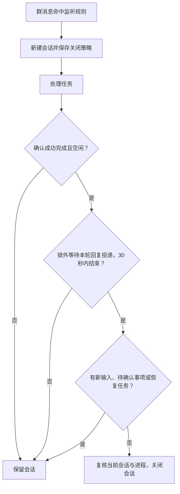
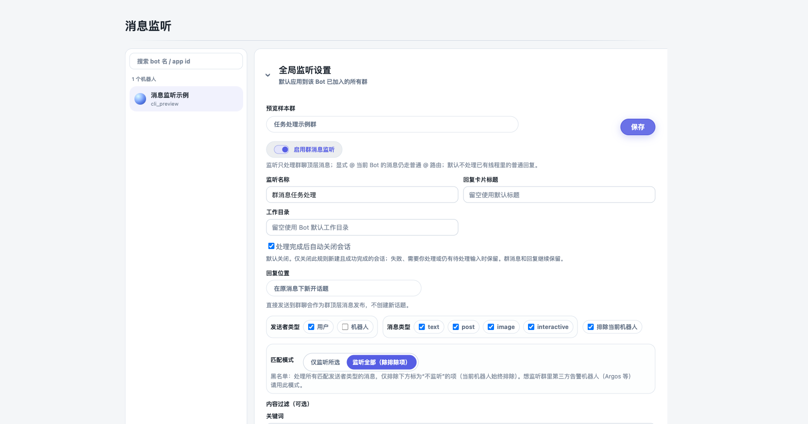

# 消息监听完成后自动关闭会话

在「消息监听」的全局规则或群自定义规则中启用「处理完成后自动关闭会话」，保存后由该规则新建的会话会在任务成功完成、进入空闲且没有待处理输入时自动关闭。开关默认关闭，旧配置继续保留会话。飞书群、原消息和已发送的回复保持可见。

截图来自真实页面组件的隔离预览，使用示例 Bot 和模拟 API；已验证勾选后保存请求包含 `autoCloseAfterCompletion: true`。

## 行为边界

- 策略在监听会话创建时保存，修改规则不批量关闭已经存在的会话。普通 @ 会话和 Dashboard 试运行会话不应用此策略。
- 只接收明确的 `completed` 终态，单独看到空闲、进程退出、失败、取消或状态不明都不会触发关闭。没有明确完成事件的 CLI 会保留会话。
- 完成与空闲事件先后均可；调度按轮次和 worker 去重，新完成轮次替换旧调度，不依赖再次收到空闲事件。延迟 1.5 秒后，在锁外最多等待 30 秒让本轮回复投递和重试结束，超时保留会话。随后在 Bot 的会话变更锁内复核当前轮次、worker 和在途投递。新输入、待发送输入、共享目录排队任务、需要用户处理的事项、未完成的恢复/续跑都会阻止关闭。
- 关闭复用已有生命周期接口；远程后端拒绝关闭时记录拒绝原因，保持原有失败处理。重启后未收到新的完成证据时保留会话。

## 实现位置

`bot-registry.ts`、`message-listener-store.ts` 负责严格布尔值配置及持久化；`message-listener.ts` 将策略传到新会话。`roles-page.tsx` 的公共编辑器同时覆盖全局与群自定义规则。`daemon.ts` 处理完成/空闲事件，`core/message-listener-auto-close.ts` 管理调度、锁外投递等待和关闭条件，最终复用 `closeSessionForBackgroundCleanup`。

仅给监听新建会话添加一个可选 JSON 字段，不新增数据库索引或依赖。公共完成回调受会话标记约束；macOS/Linux 和本地/远程后端使用相同判定，关闭行为沿用各后端已有合同。
