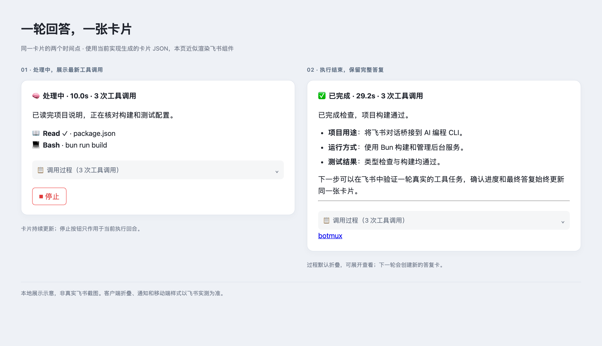

# 普通飞书对话单卡答复：首版实现与验收

本次解决一轮回答中的进度、工具调用、最终答复各自占用消息的问题。首版 opt-in；已有机器人默认兼容，不改变其发送契约。



上图由实际卡片 JSON 在本地近似渲染，非真实飞书截图。独立终端状态卡可另外开启，不属于图中的答复卡。

## 实现范围

- `replyCardMode=legacy|unified`，页面统一命名为“默认模式”和“动态单卡模式”，与 `/botconfig` 保持一致。每轮冻结模式。“显示独立状态卡”在两种模式下均可开关，切换模式保留其值。`disableStreamingCard` 和 `/card off` 仅关闭独立状态卡，不影响答复卡的动态更新。旧 `final-only` 配置兼容为 unified + disableStreamingCard，不再作为独立选项；升级前已接受轮次的投递状态仍可恢复。
- `services/turn-reply-card.ts` 保存每个 app/session/turn/attempt 的卡片 ID、进度、工具、执行状态与最终交付状态。跨进程文件锁串行化 Daemon 与短命 CLI 的更新；初次 POST 的正文与 UUID 在调用前持久化，重试保持一致。普通状态卡的 recall 流程不拥有这些答复卡。
- `core/turn-reply-card.ts` 处理入口资格、模式快照、工具更新合并、用量、短重试及断开后的状态收尾；`im/lark/turn-reply-card.ts` 复用现有 Markdown 渲染和反馈组件。工具输入/结果中的 @ 不执行为提及，私有 thinking 不进入记录。
- `cli.ts` 管理普通当前轮发送，包括回复并 @ 本轮真人提问者；显式定向、辅助消息、通知其他对象的 @ 和 attention 仍独立。进度标记与最终交付标记分开，CLI 的首次明确 final 优先于终端 fallback。
- `worker-pool.ts` 将输入提交、工具事件、最终输出、terminal 接入同一卡片。最终交付和执行结束可以以任意顺序抵达；反馈索引沿用原有身份与策略，不新增反馈体系。
- Stop 使用现有 Ctrl-C 通道和管理员权限；额外验证卡片消息及实际运行回合。状态卡的停止反馈不会覆盖主答复卡。

## 首版边界

覆盖 Claude Code / Codex 普通飞书 IM 回合；存储与更新机制不依赖 macOS 专属命令。PTY/tmux 走原输入、恢复和终态链路，真实客户端行为仍需飞书验证。其他 CLI、adopt、远程、v3、VC、文档和静默入口不切换到新交付模型。

使用同卡 PATCH，未启用 CardKit 打字机动画。工具更新约 1.2 秒合并一次；复用现有飞书客户端请求闸门。原生耗时有值时使用 Worker terminal 时间，未知时不补造终态耗时。

单卡首版不自动置顶主答复，也不内嵌审批；会话控制与原置顶逻辑保留在独立状态卡中，可自动显示或用 `/card` 手动打开。完整答案超过 24 KiB 渲染预算时交付 Markdown 附件。工具过程只展示最近的有限片段；长的未分类公开发送记录在结束时附完整文件。

普通 PATCH 的通知、未读、客户端折叠和移动端表现未通过真实飞书验证；这里不承诺 PATCH 等同于新消息通知。永久无权限/卡片不可编辑时返回失败，首版不自动另发最终卡，以免把未知发送结果变成重复消息。用户撤回后不重建。

## 本地验证

新增覆盖：并发 CLI/Daemon 发布、未知首次 POST 重试、PATCH 失败不记为最终已送达、撤回不复活、长中文全文附件、final-only 无假消息 ID、执行终态与 final 乱序、回合/应用/attempt 隔离、模式冻结和跨入口资格、断开恢复、旧 Stop 按钮拒绝、配置持久化与 Dashboard 保存回滚。

Worker 更换时，待合并的工具快照同时更新发送回调与所有权校验；旧快照投递失败不阻断后续快照。运行时回归用例覆盖这两种交错时序。

Worker 集成测试通过真实 IPC 消息处理入口投递 thinking_update / final_output / turn_terminal，检查只发送一次新消息、后续 PATCH 使用同一个 ID。相关旧测试覆盖 CoT、原状态卡、反馈、发送去重及客户端展示设置。

结束状态也区分“已记录”和“飞书已确认更新”：终态 PATCH 暂时失败后，重试或新进程会继续更新原卡，保持已确定的执行结果和耗时。

2026-09-13 本地验证：

```bash
bun run test \
  test/turn-reply-card.test.ts test/turn-reply-card-runtime.test.ts \
  test/bridge-final-output-retry.test.ts test/bridge-fallback-gate.test.ts \
  test/card-handler-stop-compact.test.ts test/card-prefs-auto-start.test.ts \
  test/dashboard-streaming-card-pin-toggle.test.ts test/recall-frozen-cards.test.ts \
  test/worker-ready-display-mode.test.ts test/cot-message.test.ts \
  test/reply-card-style.test.ts test/card-runtime-status-bridge.test.ts \
  test/card-stream-store.test.ts test/cli-card-stream-dispatch.test.ts \
  test/bot-config-store.test.ts test/skill-feedback-card.test.ts --silent
bun run build
git diff --check
```

上述回归 16 个文件、533 项测试通过，完整构建和差异格式检查通过。以实际构建函数生成了两种状态的卡片 JSON，并用本地浏览器生成展示示意、检查过程面板展开；这是近似渲染，不能替代飞书客户端验收。

本机部署：`bun run use:here` 将入口指向当前 checkout，用户已配置测试机器人，Dashboard 和 daemon 已运行。用户首轮飞书测试发现 `--mention-back --response-kind final` 被当成独立通知，导致过程和答复分离。现已收窄为“通知其他对象、机器人或身份未知对象时独立发送”；启动等待提示复用当前卡片。Dashboard 改用现有下拉菜单，将模式说明与控件对齐，手动状态卡控制与答复展示分开说明。

新增 `test/cli-send-reply-card.test.ts` 通过真实 CLI 子进程与封闭的飞书 API 测试桩，覆盖 Claude Code/Codex 的 `--mention-back`、显式 @ 提问者、无 @、其他收件人、机器人与未知身份；检查只 PATCH 原消息、保留工具过程并记录正确的最终发送标记。Worker receipt 回归覆盖动态单卡、关闭自动进度和默认模式。飞书真实发送仍由用户执行。

补充验证：12 个相关测试文件共 435 项通过（旧发送路径的源码断言更新后单独复跑通过）；`bun run build`、`git diff --check` 通过。浏览器检查了单卡设置、对齐、菜单展开和选中状态。修复已部署本地 daemon；尚待用户对新一轮飞书消息进行验收。

## 改动文件

| 模块 | 文件 |
| --- | --- |
| 回合持久化与发布 | `src/services/turn-reply-card.ts` |
| 运行时适配与生命周期 | `src/core/turn-reply-card.ts`、`src/core/worker-pool.ts`、`src/core/types.ts`、`src/daemon.ts` |
| 飞书渲染、停止、命令 | `src/im/lark/turn-reply-card.ts`、`src/im/lark/card-handler.ts`、`src/core/command-handler.ts` |
| 显式发送与最终答复去重 | `src/cli.ts`、`src/worker.ts`、`src/services/bridge-fallback-gate.ts` |
| 配置与 Dashboard 接口 | `src/bot-registry.ts`、`src/services/card-prefs-store.ts`、`src/services/bot-config-store.ts`、`src/core/dashboard-ipc-server.ts`、`src/dashboard/bot-payload.ts` |
| Dashboard 与文案 | `src/dashboard/web/bot-defaults.ts`、`src/dashboard/web/bot-defaults-page.tsx`、`src/dashboard/web/i18n.ts`、`src/i18n/zh.ts`、`src/i18n/en.ts` |
| 新增及更新的回归测试 | `test/turn-reply-card.test.ts`、`test/turn-reply-card-runtime.test.ts`、`test/bridge-final-output-retry.test.ts`、`test/card-handler-stop-compact.test.ts`、`test/card-prefs-auto-start.test.ts`、`test/dashboard-streaming-card-pin-toggle.test.ts` |
| 用户文档与验收 | `docs-site/docs/zh/cards.md`、本文 |

## 飞书手动验收

1. 在测试机器人 Dashboard 选择动态单卡模式，并关闭“显示独立状态卡”。切换默认/动态模式时确认这个开关不变。
2. 新开一轮：“读取 README.md 和 package.json，先给一条进度，再总结你看到的内容；最终用 botmux send --response-kind final 发送。”预期同一卡片展示处理中、工具调用，结束后出现完整答复、折叠过程；没有独立 CoT 或自动终端状态卡。
3. 再问一次，确认创建新的答复卡，上一轮答复仍保留。分别在话题和普通群检查回复落点。
4. 做一次较长的工具任务，点击本轮 Stop。预期停止当前任务、保留会话和答复卡；再开始新任务后点击旧卡的 Stop，不能影响新任务。
5. 开启“显示独立状态卡”，群内曾 `/card off` 时执行 `/card on`。新一轮应有独立终端状态卡和动态答复卡，两者分别更新。再用 `/card off`，答复卡仍动态更新，独立状态卡不再自动显示；切回默认模式，独立状态卡仍遵守同一开关。
6. 关闭工具输出，确认新一批更新不再显示输出内容；试 `/cot show` 与 `/card`，后者仍是独立诊断卡。检查反馈按钮（仅在原反馈策略已开启时出现）、语音总结和附件。
7. 生成超过卡片预算的长中文答复，检查附件全文；检查代码、表格、链接、移动端折叠、历史读取与引用是否完整。
8. 可选测试：运行中重启、断网恢复、撤回主卡片；观察状态能否收尾、恢复后是否仍更新原卡，以及撤回后是否保持不重建。

飞书实测由用户执行；没有在本次本地测试中向真实聊天发送测试消息。
