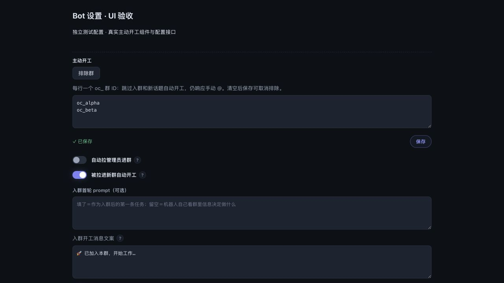
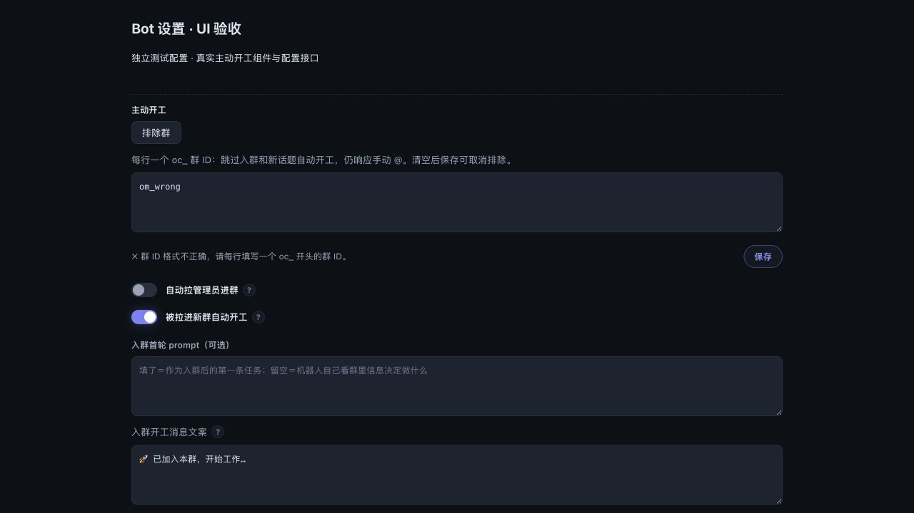

# 群级自动开工排除：浏览器截图验收

2026-09-25，PR #1562。本地浏览器实测，使用真实 `AutoStartControls`、Dashboard CSS 和实际 IPC 配置读写接口；仅用虚构 Bot 和群 ID，配置保存在临时目录，不连接飞书、不修改运行中的机器人。

这是组件集成页的交互与截图验收，不是远端完整 Dashboard 验收，也不是像素差异自动回归基线。

## 复现

在仓库根目录安装项目依赖后运行：

```sh
node --import tsx test/fixtures/auto-start-exclusions/serve.mjs
```

打开 `http://127.0.0.1:18791`。此端口仅监听本机；退出时 Ctrl+C。服务每次启动创建新的测试配置，终端会打印路径。前端改动后重启服务并刷新浏览器。

## 检查结果

| 场景 | 操作与结果 | 截图 |
| --- | --- | --- |
| 默认收起 | 排除按钮可见，文本框隐藏；两个自动开工开关仍开启 | [collapsed.png](collapsed.png) |
| 展开并保存 | 输入 ` oc_alpha `、空行、`oc_beta`、重复的 `oc_alpha`，点击保存；回显两行去重结果并提示已保存 | [saved.png](saved.png) |
| 刷新回显 | 刷新后再次展开，仍是 `oc_alpha`、`oc_beta` | [reloaded.png](reloaded.png) |
| 错误输入 | 输入 `om_wrong`，保存被拒绝，按钮旁显示中文提示；刷新仍保留原来的两项配置 | [invalid.png](invalid.png) |
| 清空 | 全选删除内容，保存后刷新再展开，文本框为空 | [cleared.png](cleared.png) |
| 窄屏 | 390 × 844 CSS px；输入、保存按钮和反馈可见，页面宽度为 390，无横向溢出 | [mobile.png](mobile.png) |

桌面视口 1280 × 720 CSS px，深色主题。人工检查截图中的文字、输入框、按钮及错误提示，无重叠；浏览器控制台无 warning/error。成功提示使用原有的 1.5 秒淡出样式。

截图验收发现并修复了保存按钮显示 `common.save` 的翻译键遗漏；保存按钮使用已有操作行样式，错误提示改为中文并放在对应按钮旁。组件测试增加了按钮文案和错误提示位置断言。

本轮验证：相关 3 个测试文件 316 项通过；新增错误提示断言后组件文件 7 项通过。TypeScript 检查、Dashboard 打包通过。

## 桌面保存



## 错误输入



## 窄屏


