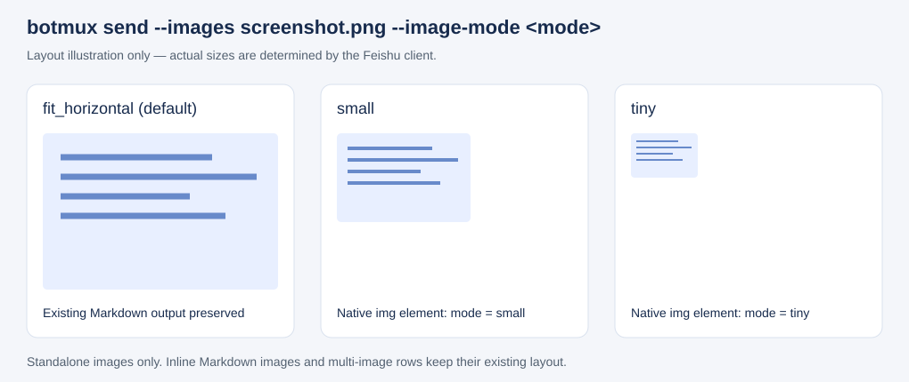

# 发送图片的缩小预览

```sh
# 当前任务等待扫码授权才能继续
botmux send --images /tmp/qrcode.png --image-mode small --attention=authz --mention-back "需要你扫码授权才能继续；若看不清，可点击图片放大。"
botmux send --images /tmp/screenshot.png --image-mode medium --mention-back "截图"
```

`--image-mode` 控制独立单图的布局。缩小档位保留完整图片和原始宽高比，仍可点击预览。

按图片用途选择尺寸：二维码、图标等小图优先使用 `small`，避免占满卡片；需要直接阅读文字或细节的截图、图表保留默认全宽，或使用 `medium`。用户明确要求的尺寸优先。二维码缩小后仍需清晰可扫，空间不足时选择更大档位或提示点击预览。

这条规则同时出现在会话发送提示、技能摘要和完整发送指南中：Agent 在发送图片/附件前应先执行 `botmux skill show botmux-send`。只更新长指南正文，无法覆盖未读取技能而直接执行 `botmux send --images` 的情况。新建会话和后续消息都会注入紧凑的图片规则；已有会话的系统提示不会自动刷新，但下一轮提醒会重新读取当前规则。

当前任务必须等用户扫码授权才能继续时，同一条请求带 `--attention=authz`，将会话标进看板「需要你」列；发完结束本轮、等用户回复。只是展示二维码、任务还能继续时，不加举手标记。

| 参数 | 行为 |
| --- | --- |
| 不传 / `fit_horizontal` | 保持现有全宽 Markdown 图片输出 |
| `medium` | 占可用宽度的 1/2，完整显示 |
| `small` | 占可用宽度的 1/3，完整显示 |
| `tiny` | 占可用宽度的 1/4，完整显示 |

这里的 medium/small/tiny 是 **botmux 的分栏宽度档位**，不是飞书 `size` 字段的方形尺寸档位。缩小比例相对卡片可用宽度，窄屏仍按比例收缩，不表示固定像素宽度，也不是原始文件像素的缩放比例。

末尾追加的 `--images` 图片、独占一行的 ``、以及不带 `--images` 而在正文独占一行的 `` 均支持此参数。正文行内图片、并排多图、代码块维持原有行为。非法值或缺值以退出码 2 拒绝。早期 PR 版本的 `large` 和 `crop_center` 已移除，同样报错退出。



以上为布局示意，不是飞书客户端截图。实际客户端视觉效果仍需实测。

实现采用 schema 2.0 原生 `img.scale_type: fit_horizontal`，置于 `column_set` 的 2、3 或 4 个等权分栏中，第一列放图片，其余列为空白；所有列的 `weight` 均为 1；`flex_mode: none` 保持窄屏比例。图片不设置 `size`、`custom_width` 或旧版 `mode`。默认路径和原有多图并排路径保持原样。

依据：[飞书 2.0 图片组件](https://open.feishu.cn/document/feishu-cards/card-json-v2-components/content-components/image) 将 `fit_horizontal` 定义为完整展示、不裁剪，并说明 `size` 仅在裁剪模式下生效；[分栏组件](https://open.feishu.cn/document/feishu-cards/card-json-v2-components/containers/column-set) 支持 `weighted` 宽度与 `none` 窄屏比例压缩。

不使用非等权比例：PR 实际服务端回读发现非等权会被压平为 1:1，而多个等权列能保留。该回读证据来自维护者，当前分支的本地测试验证最终出站 JSON，尚未独立执行真实服务端回读和客户端视觉验收。
